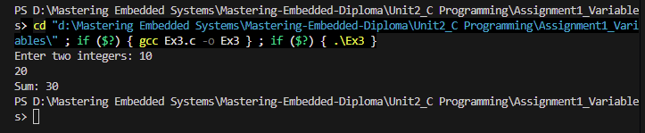
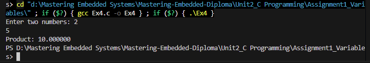
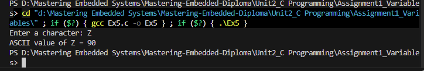
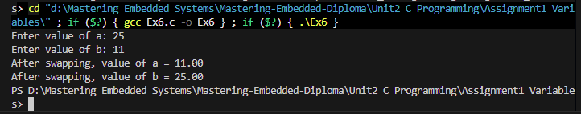
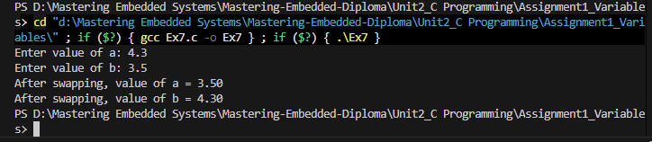

# Assignment 1: Variables - Operation Images

## Runtime Screenshots

Below are the execution screenshots demonstrating the variables assignment operations:

### Example 1

### Example 2

### Example 3

### Example 4

### Example 5

### Example 6

### Example 7

