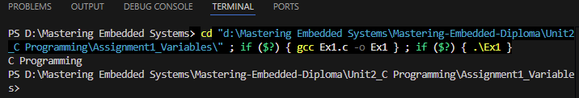
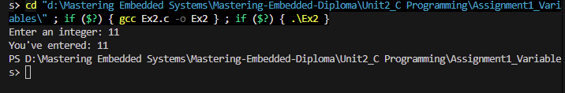

# Assignment 1: Variables - Operation Images

## Runtime Screenshots

Below are the execution screenshots demonstrating the variables assignment operations:

### Screenshot 1

### Screenshot 2

### Screenshot 3

### Screenshot 4

### Screenshot 5

### Screenshot 6

### Screenshot 7

