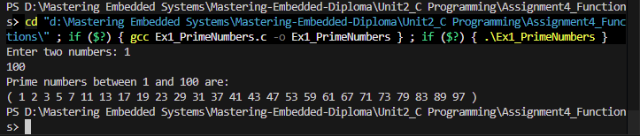
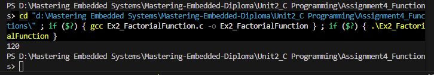
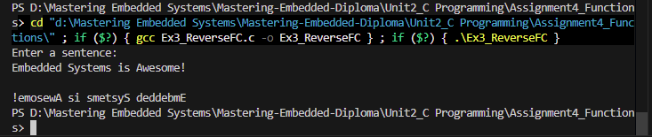
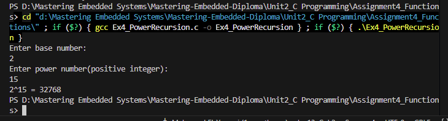

# Assignment 4: C Functions - Operation Images

## Runtime Screenshots

Below are the execution screenshots demonstrating the C Functions assignment operations:

### Example 1

### Example 2

### Example 3

### Example 4

