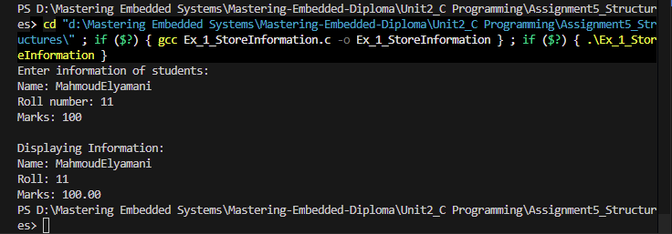
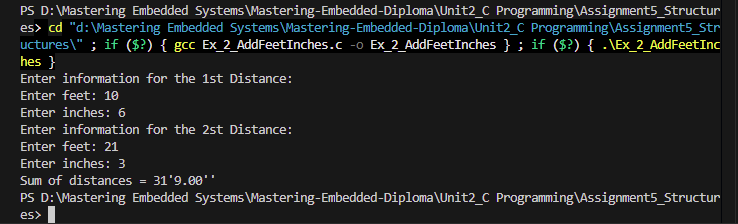
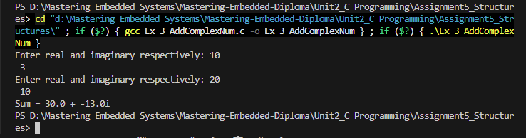
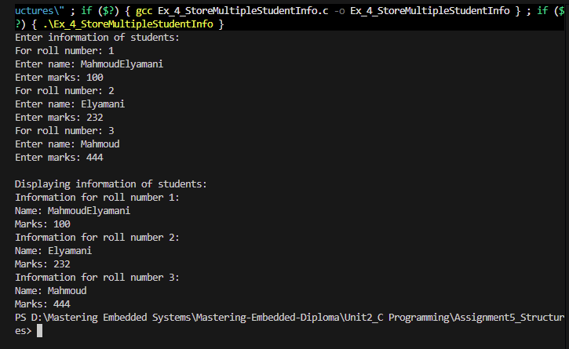
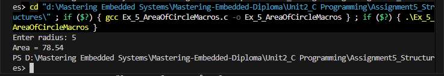
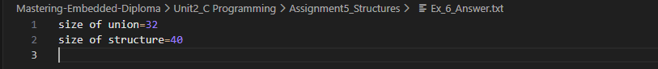

# Assignment 5: Structures/Unions - Operation Images

## Runtime Screenshots

Below are the execution screenshots demonstrating the Structures/Unions assignment operations:

### Example 1

### Example 2

### Example 3

### Example 4

### Example 5

### Answer to Example 6

