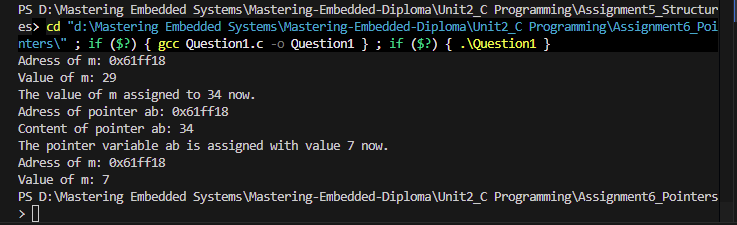
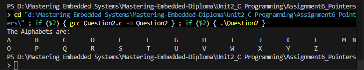
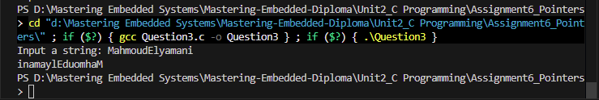
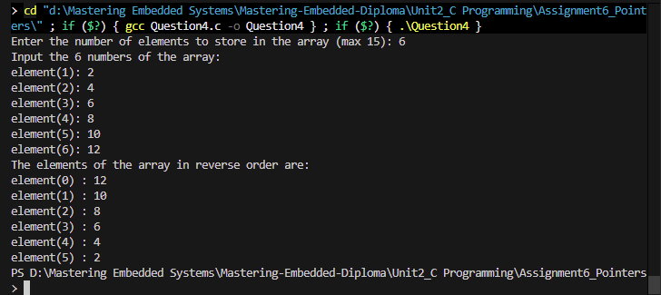
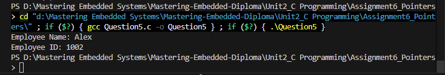

# Assignment 3: Pointers - Operation Images

## Runtime Screenshots

Below are the execution screenshots demonstrating the Pointers assignment operations:

### Question 1

### Question 2

### Question 3

### Question 4

### Question 5

