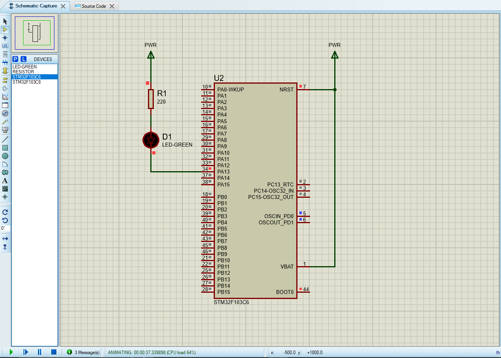
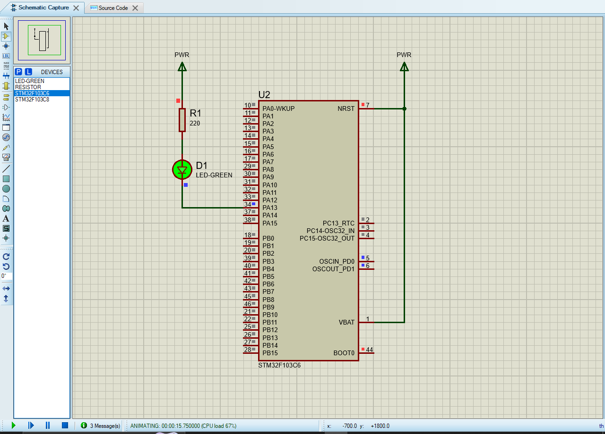

# Assignment 1: LED Blink Using an IDE - Operation Images

## Runtime Screenshots

Below are the execution screenshots demonstrating the LED Blink assignment operations:

### Operation 1

### Operation 2
