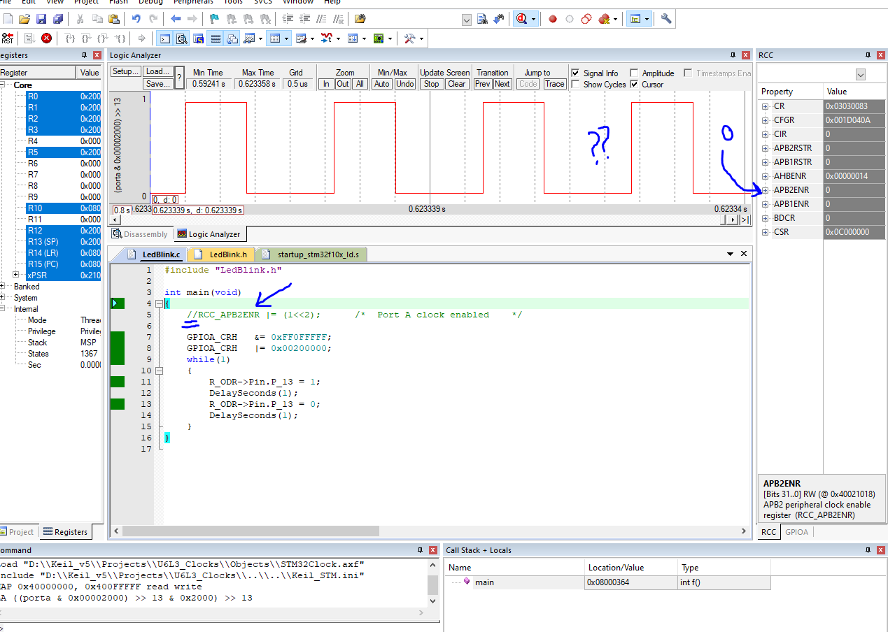
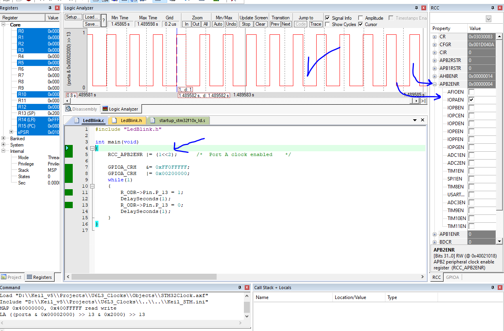
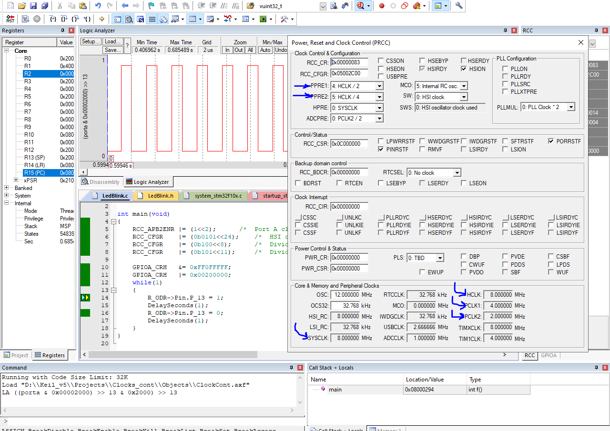
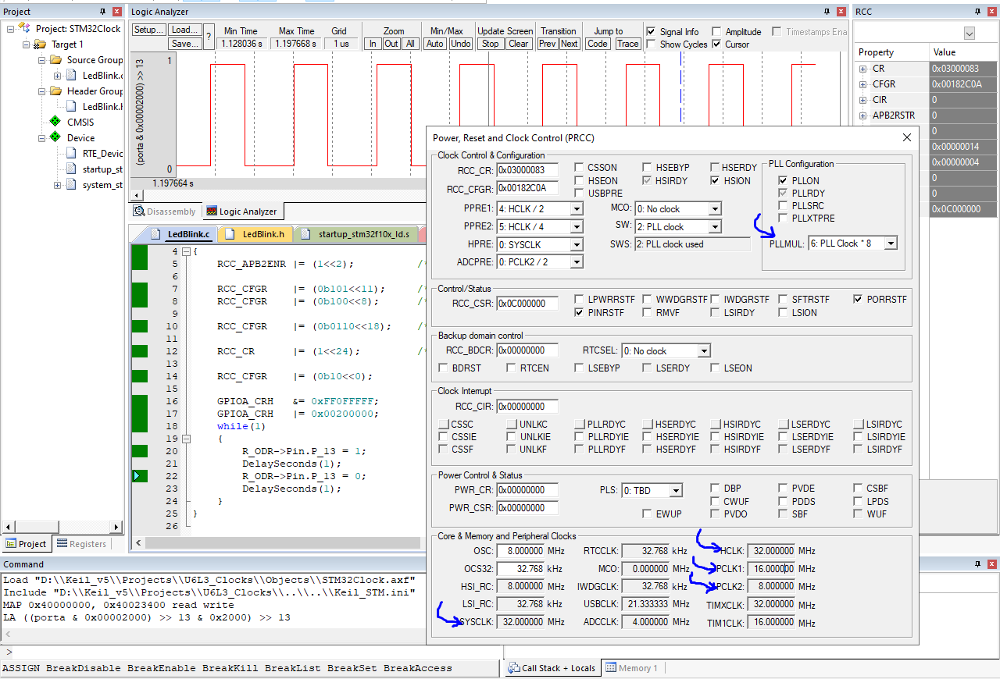

# Unit6 Lesson 3 Lab Operation, below images showcase different cases of Keil uVision simulation

## Lab answers:

The 3 labs showcase different codes found in the same folder as the LAB:

### LAB 1
Before enabling the register:

After enabling the register:

### LAB 2:
• APB1 Bus frequency 4MHZ
• APB2 Bus frequency 2MHZ
• AHB Bus frequency 8MHZ
• SysClk 8MHZ
• Use only internal HSI_RC

### LAB 3
• APB1 Bus frequency 16MHZ
• APB2 Bus frequency 8MHZ
• AHB Bus frequency 32MHZ
• SysClk 32MHZ
• Use only internal HSI_RC
