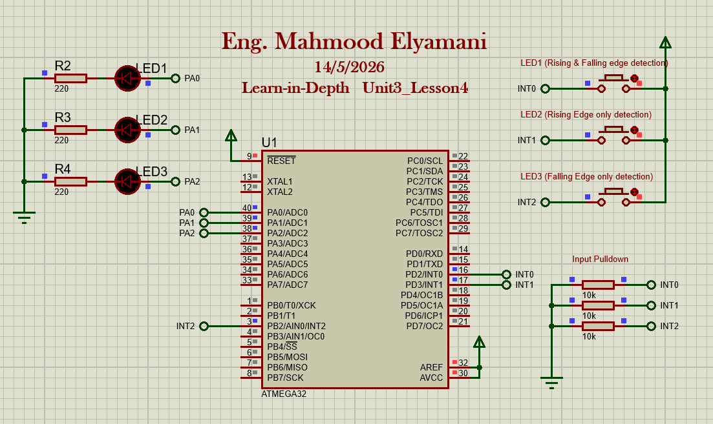
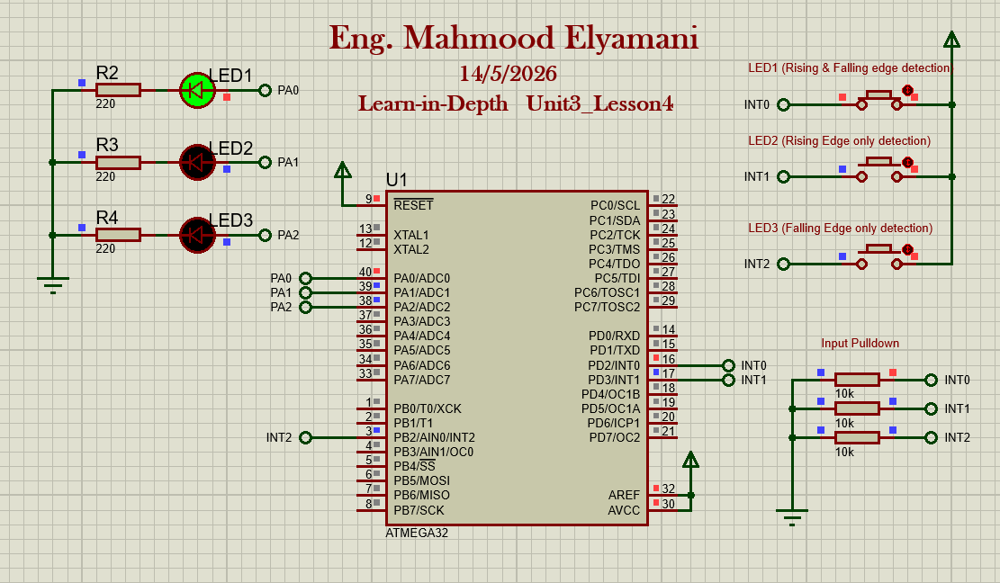
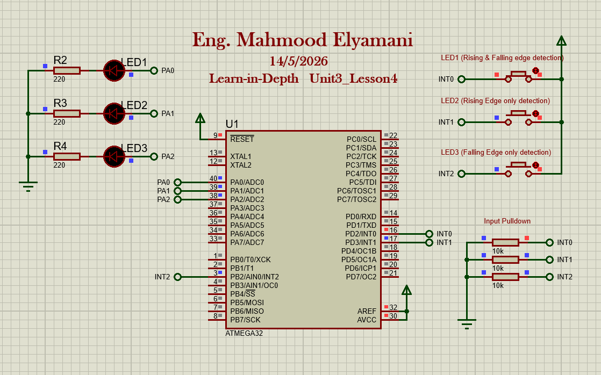
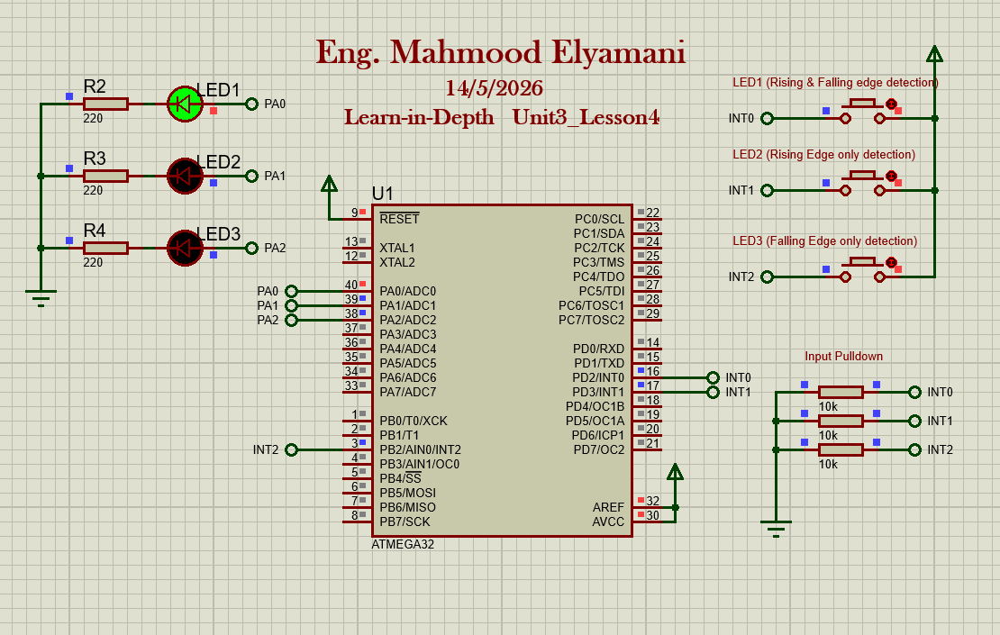
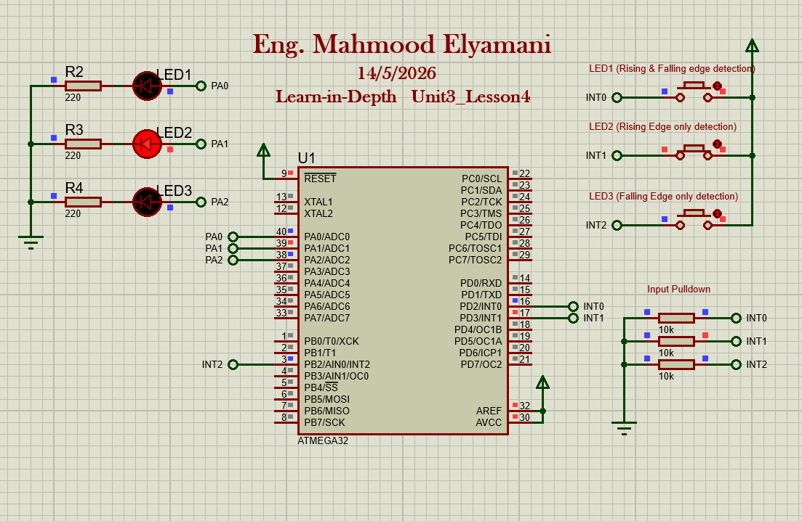
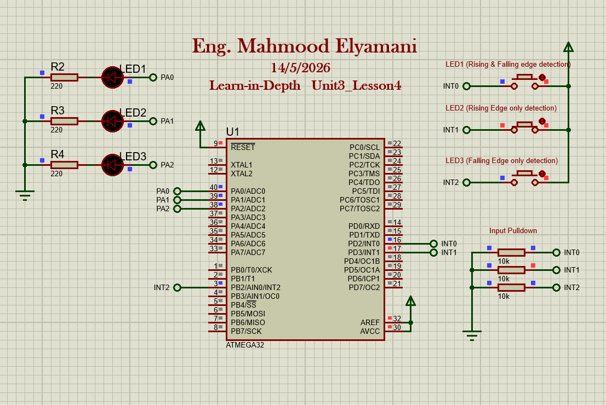
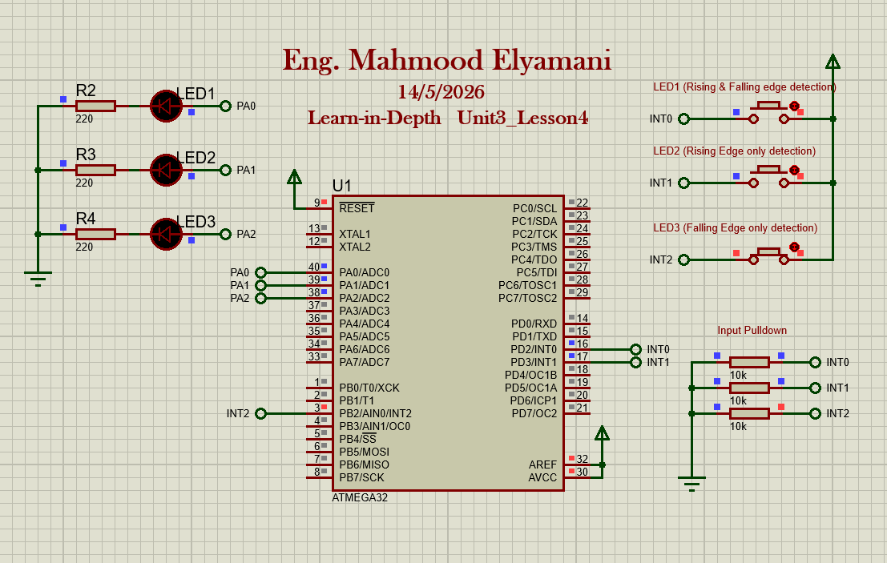
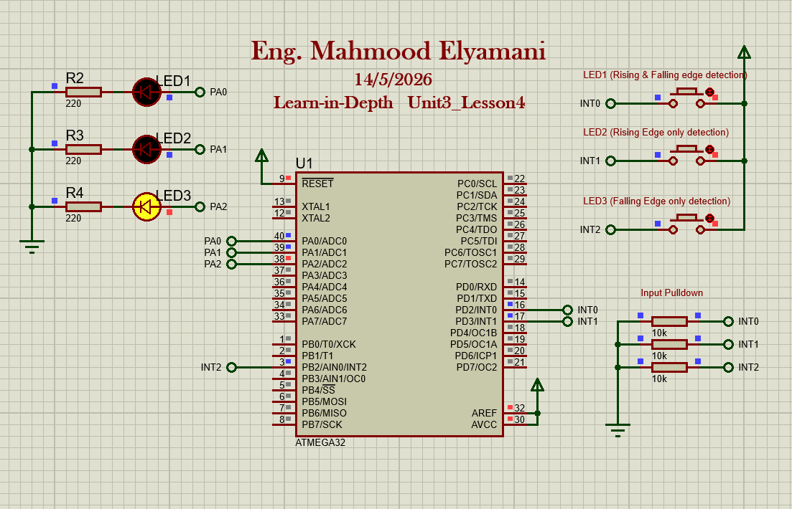

# Unit6 Lesson 4 Proteus simulation operation of ATmega32 interrupts

## Simulation Circuit:

The 3 different operations discussed below are regarding the 3 external interrupts on Atmega32 and the 3 states of operation

### External interrupt 0: 
Push button connected to EXT0 is pressed:

Led turns off while the button is still held:

Push button connected to EXT0 is released:

### External interrupt 1:
Push button connected to EXT1 is pressed:

Led turns off while the button is still held:

Push button connected to EXT1 is released:

### External interrupt 2:
Push button connected to EXT2 is pressed:

Push button connected to EXT2 is released:
