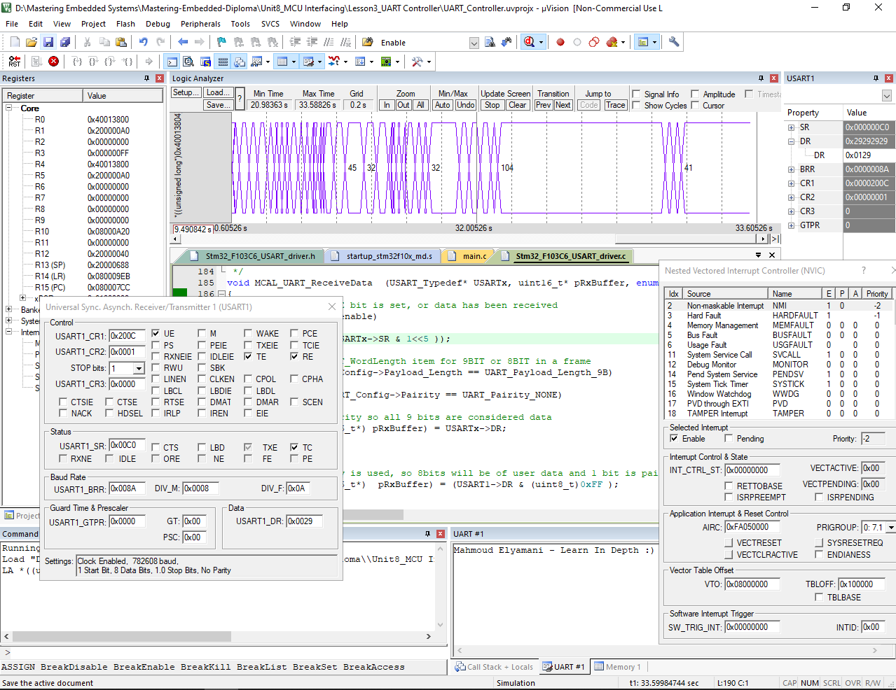
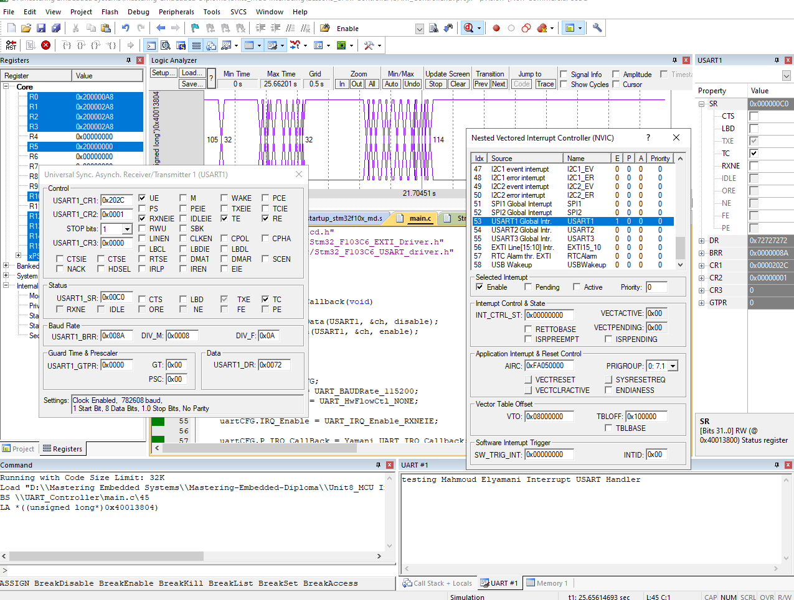

# Unit8 Lesson 3, UART/USART Protocol Simulation and Debugging Images:

Below are the KeiluVision operation images for UART protocol operation

### Case 1: UART communication using polling method for UART receiver

### Case 2: UART communication using Interrupt method for UART receiver

